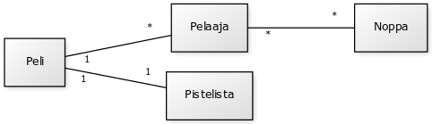
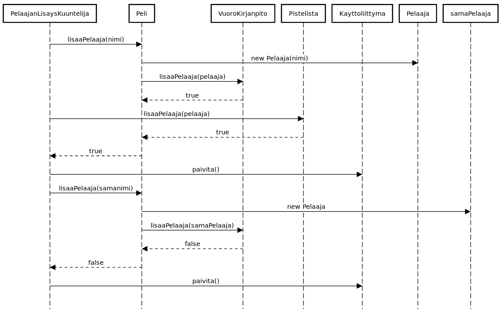
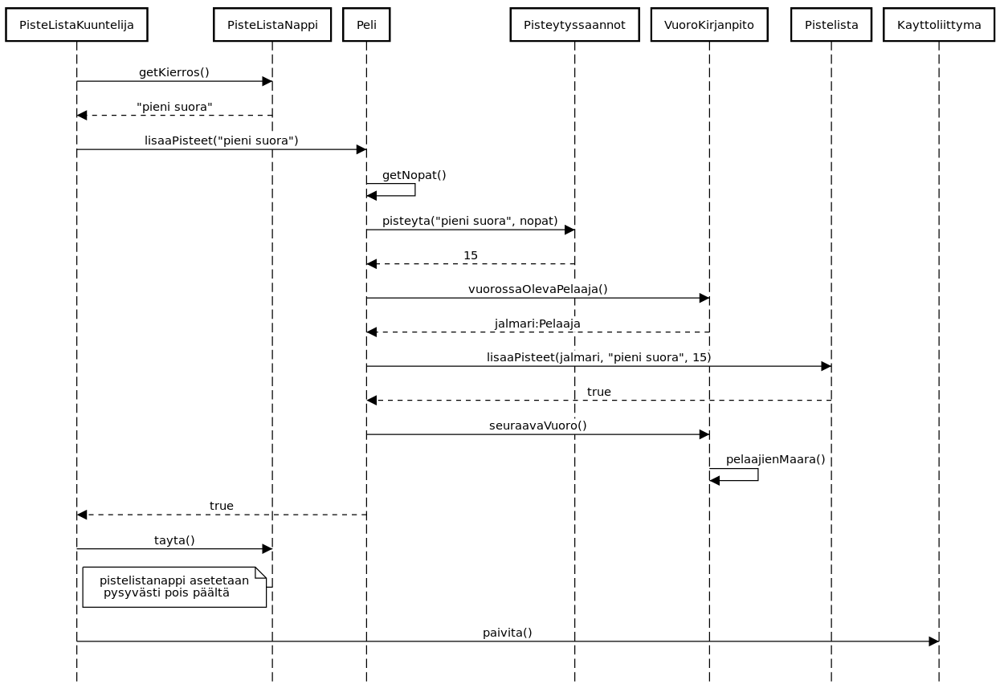
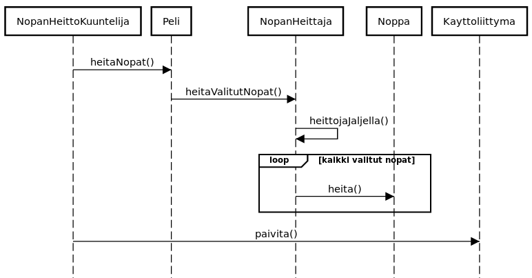

__Aihe:__ yatzy. Toteutetaan yatzy-peli, jossa mahdollisuus pelata ihmisiä vastaan paikallisesti. Tavallisen pelimuodon lisäksi toteutetaan muunnelmista "pakkoyatzy", jossa pelaaja ei voi valita haluamaansa paikkaa pisteille, vaan kierrokset pelataan järjestyksessä.

__Käyttäjät:__ pelaaja(t)

## Käyttäjien toiminnot:
- Pelaajanimimerkin lisääminen
- Heitettävien noppien valitseminen
- Noppien heittäminen
- Pisteiden kirjaaminen

## Luokkakaavio

## Rakennekuvaus
__Peli__-luokka toimii välittäjänä käyttöliittymän ja logiikkakomponenttien välillä. Se käyttää tuntemiensa luokkien metodeita pelin tilan siirtämiseksi eteenpäin. Tuntee seuraavat luokat:
- __VuoroKirjanpito:__ Pitää kirjaa pelin etenemisestä vuoronumeron ja kierrosnumeron avulla. Se tietää, milloin peli on loppu ja kuka pelaajista on vuorossa milläkin hetkellä. Tuntee Pelaaja-luokan.
- __NopanHeittaja:__ Huolehtii nopista ja niiden heittämisestä. Tuntee Noppa-luokan.
- __Pistelista:__ Tallentaa HashMap-tyyppiseen muuttujaan pelaajat, kierrokset ja niistä saadut pisteet. Laskee myös yatzyn bonus-sääntöä. Tuntee Pelaaja-luokan.
- __Pisteytyssäännöt:__ Sisältää joukon metodeita, joiden avulla voidaan määrittää tiettyjen pistelukujen antamat pisteet tietylle kierrokselle.

Noppa ja Pelaaja eivät tee paljoakaan. Noppa osaa arpoa itselleen pisteluvun, Pelaaja taas on vain säilö nimelle.

__Käyttöliittymä__ koostuu muutamasta erilaisesta nappiluokasta, jotka perivät JButton:n tai JToggleButton:n. Yliluokkien toiminnallisuuden lisäksi ne tietävät asioita käynnissä olevasta pelistä. Ne toteuttavat myös Paivitettava-rajapinnan, joka määrittelee yhden metodin: paivita(). Se ajettaessa nappi päivittää oman tilansa vastaamaan pelin tilaa.

Kayttoliittyma-luokka säilöö listan Paivitettava-tyyppisia olioita, jotka ovat siis kaikki käyttöliittymän napit. Se toteuttaa itsekin tämän rajapinnan, ja sen paivita() kutsuu jokaisen listalla olevan napin paivita() -metodia.
Lisäksi on tapahtumakuuntelijoita, jotka siirtävät pelin tilaa eteenpäin ja kutsuvat sen jälkeen käyttöliittymän paivita() -metodia. Näin käyttöliittymän ja pelin tila pysyvät synkronoituina.

## Sekvenssikaaviot

### Pelaajan lisääminen

### Pisteiden kirjaaminen

### Noppien heittäminen

