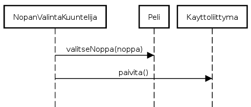

__Aihe:__ yatzy. Toteutetaan yatzy-peli, jossa mahdollisuus pelata ihmisiä vastaan paikallisesti. Tavallisen pelimuodon lisäksi toteutetaan muunnelmista "pakkoyatzy", jossa pelaaja ei voi valita haluamaansa paikkaa pisteille, vaan kierrokset pelataan järjestyksessä. Lisäksi ohjelma kerää tilastoja peleistä ja pelaajista.

__Käyttäjät:__ pelaaja(t)

###Käyttäjien toiminnot:
- Pelaajanimimerkin lisääminen
- Heitettävien noppien valitseminen
- Noppien heittäminen
- Tuloksen kirjaaminen

