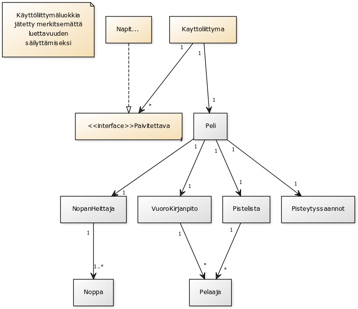

__Aihe:__ yatzy. Toteutetaan yatzy-peli, jossa mahdollisuus pelata ihmisiä vastaan paikallisesti. Tavallisen pelimuodon lisäksi toteutetaan muunnelmista "pakkoyatzy", jossa pelaaja ei voi valita haluamaansa paikkaa pisteille, vaan kierrokset pelataan järjestyksessä.

__Käyttäjät:__ pelaaja(t)

## Käyttäjien toiminnot:
- Pelaajanimimerkin lisääminen
- Heitettävien noppien valitseminen
- Noppien heittäminen
- Pisteiden kirjaaminen

## Luokkakaavio

## Sekvenssikaaviot

### Pelaajan lisääminen

### Pisteiden kirjaaminen

### Noppien heittäminen

